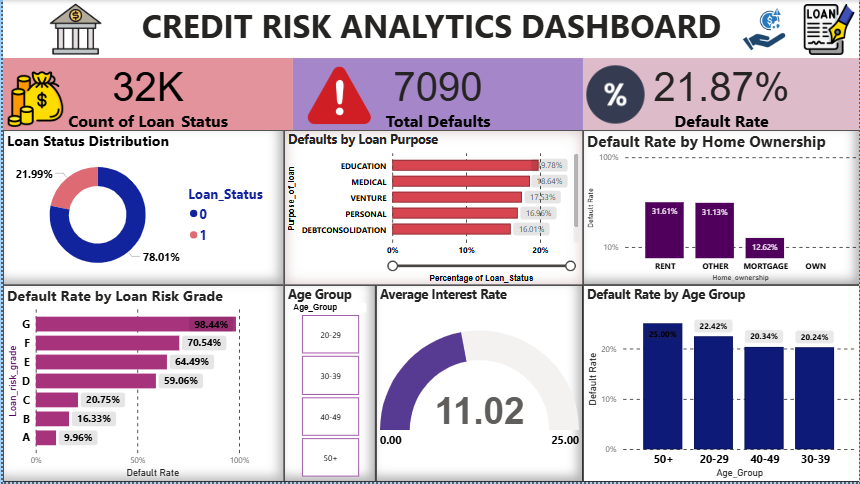

# Credit Risk Analytics

## 📌 Project Overview

This project analyzes loan and customer data to identify patterns related to credit risk and loan defaults.

The project follows an end-to-end data analytics workflow using Excel, SQL, Python, and Power BI.

## 🎯 Business Objective

The main objective is to analyze loan data and understand factors associated with loan defaults, including:

- Loan risk grade
- Loan purpose
- Interest rate
- Customer income
- Age group
- Home ownership
- Loan amount

## 🛠️ Tools & Technologies

- **Excel** – Data cleaning and initial analysis
- **SQL** – Data querying and business analysis
- **Python** – Data analysis and visualization
- **Power BI** – Interactive dashboard and reporting

## 🔄 Project Workflow

Raw Dataset  
↓  
Data Cleaning in Excel  
↓  
SQL Analysis  
↓  
Python Analysis & Visualization  
↓  
Power BI Dashboard  
↓  
Business Insights

## 📊 Power BI Dashboard

The Power BI dashboard provides an overview of:

- Total Loans
- Total Defaults
- Overall Default Rate
- Loan Status Distribution
- Defaults by Loan Purpose
- Default Rate by Loan Risk Grade
- Default Rate by Home Ownership
- Default Rate by Age Group
- Average Interest Rate

## 🔍 SQL Analysis

SQL was used to answer business questions such as:

1. What is the total number of loans?
2. What is the overall default rate?
3. Which loan risk grade has the highest default rate?
4. Which loan purpose has the most defaults?
5. What is the average loan amount by loan grade?
6. How does the average interest rate differ between defaulted and non-defaulted loans?
7. How does default rate vary by income group?
8. How does default rate vary by home ownership?
9. How does default rate vary by age group?
10. What is the overall risk summary by loan grade?

## 🐍 Python Analysis

Python was used for:

- Default distribution analysis
- Default rate by loan risk grade
- Defaults by loan purpose
- Income comparison
- Interest rate comparison
- Loan amount comparison
- Age group analysis
- Home ownership analysis
- Correlation analysis
- Business insight generation

Libraries used:

- Pandas
- Matplotlib
- Seaborn

## 📈 Key Insights

The analysis focuses on identifying patterns in loan defaults and understanding how borrower and loan characteristics relate to credit risk.

The Power BI dashboard provides an interactive way to explore these patterns across different customer and loan segments.

## 📁 Project Files

| File | Description |
|---|---|
| `credit_risk_dataset.csv` | Original/raw dataset |
| `Credit_Risk_dataset_cleaned.xlsx` | Excel analysis |
| `Credit_Risk_Queries.sql` | SQL queries |
| `Credit_Risk_Analysis.ipynb` | Python analysis |
| `Credit_Risk_Dashboard.pbix` | Power BI dashboard |

## 👩‍💻 Skills Demonstrated

- Data Cleaning
- Exploratory Data Analysis
- SQL Querying
- Data Visualization
- Business Analysis
- Power BI Dashboard Development
- Credit Risk Analysis
